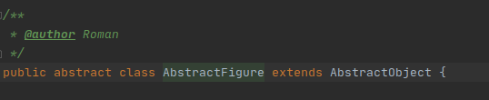

 # Для добавления новых фигур или других игровых объектов:
 
 Новые классы объектов прописываются в каталоге bgs.objects.  

 1. Предварительно, для этой новой группы объектов создается родительский абстрактный класс который наследуется от класса в gameCore.
    В нем может быть прописана базовая логика группы. 
     
 2. Для добавления новых фигур или изменения их логики поведения изменять или добавлять классы фигур в пакет figure. 

