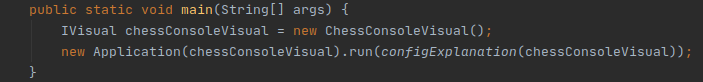
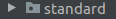
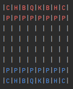

  ### Для добавления нового визуала:

  1. Добавлять классы исполняющие интерфейс IVisual в пакет bgs.visual. 
  
  2. Создавать класс Application с объектом нового визуала в конструкторе.  
    
  
  3. Для изменения стандартного визуала заменять классы в пакете bgs.visual.standard.  
    
     
  ### Стандартное консольное отображение:
  
   
