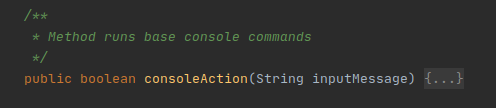

 ### Общие рекомендации:
  
 * Новый модульный функционал добавлять в директорию modules или как библиотеку .jar в libs.
 * При дальнейшем усовершенствовании основной класс Application можно изменять в зависимости от требований.
 * Для добавления новых консольных команд дорабатывать метод consoleAction в bgs.visual.standard.ConsoleVisual.java  
  