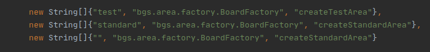

 ## Для добавление новой игровой области:
  **Рекомендую ознакомиться с интерфейсом IArea в модуле GameCore.**
 
 1. Создать новый класс области и добавить его в bgs.area
 2. Для добавления базового функционала требуется наследовать новый класс от AbstractArea.
   
 3. Реализовать нужный функционал.
 4. Добавить новую фабрику или изменить методы старой в bgs.area.factory. 
 5. В bgs.setup.alias.AreaAliasList добавить новый алиас на метод фабрики для создания конкретной конфигурации области.  
  
 
 ### Общая информация:
 
 #### Нумерация клеток:
 
 

  