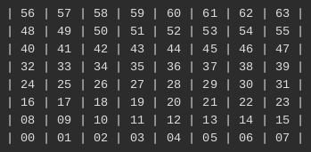
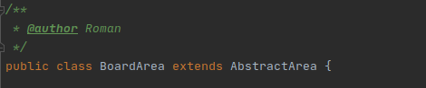

 ## Нумерация игровых клеток:

 Рекомендую ознакомиться с интерфейсом IArea в модуле GameCore.

 0. Для добавления базового функционала требуется отнаследовать новый класс от AbstractArea.
   
 1. Новые класс добалить в bgs.area
 2. Добавить или изменить методы в bgs.area.factory. 
 3. В bgs.setup.alias.AreaAliasList добавить новый алиас на метод фабрики для создания конкретной конфигурации области.