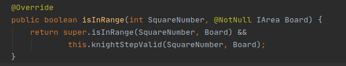

### Для добавления новых групп объектов или доработки уже имеющихся:
 
 1. *Новые классы объектов прописываются в bgs.objects.*  

 2. Предварительно, для этой новой группы объектов создается родительский абстрактный класс который наследуется от класса в gameCore.
    В нем может быть прописана базовая логика группы. 
     
 
#### Общие указания:  
    
  1. Пример **правильно** созданного метода isInRange для реализации логики объекта.  
       
   
  2. Для добавления новых фигур или изменения их логики поведения изменять или добавлять классы в bgs.objects.figure. 
 